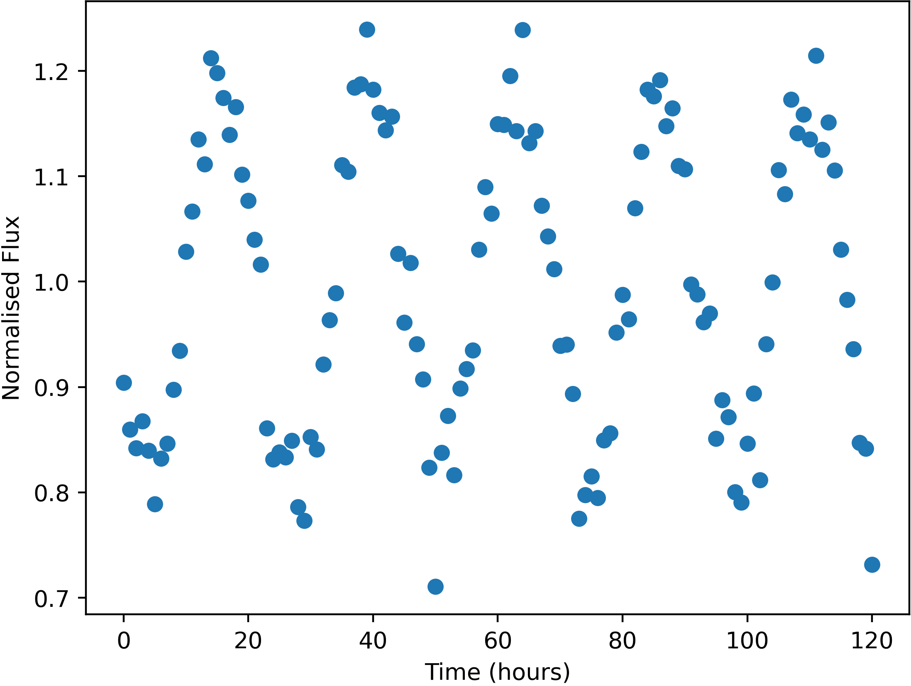

## Images from the Wide Field Cameras
Click on the images for the data on that part of the sky!
### Back Camera Image

'Right' joins the left of this image, and 'Left' the right.
### Bottom Camera Image

'Left' joins the top of this image, 'Front' the right, 'Right' the bottom, and 'Back' the left.
### Front Camera Image

'Left' joins the left of this image, and 'Right' the right.
### Left Camera Image

'Back' joins the left of this image, and 'Front' the right.
### Right Camera Image

'Front' joins the left of this image, and 'Back' the right.
### Top Camera Image

'Right' joins the top of this image, 'Front' the right, 'Left' the bottom, and 'Back' the left.
### Cubemap Image Alignment

## Variable Star Data
Some stars in the sky were found to change in apparent brightness over time, usually following a periodic trend.

Example of a variable star lightcurve - star BackS61625
Units of the variable data are:

 Measurement | Unit 
 --- | ---
 Time | hours
 Normalised Flux | unitless

Uncertainties in this data (one standard deviation) are:

 Measurement | Uncertainty 
 --- | ---
 Time | 0.3 hours
 Normalised Flux | 1.5%

[Download a compressed .zip file of all of the variable star lightcurve data.](Variable_Star_Data.zip)
## X-Ray All-Sky Camera Data
The X-Ray camera did not detect any steady sources. It did detect, however, a number of extremely 
short X-Ray flashes coming from various parts of the sky. Each flash lasted 51 milliseconds, but 
we see that the number of photons from each flash is far from the same.
Here is a list of the flashes detected, with their approx. positions and number of photons detected. 
Positions are given by where they would appear in the relevant wide-field camera image. 
Positions are only accurate to 0.05 degrees (one standard deviation). 
The X-Ray camera is sensitive to burts of more than 174 photons only. 
[Download a .txt file of the below data](Flash_Data.csv)

 Name | Direction | X | Y | Photon-Count 
 --- | --- | --- | --- | --- 
 FE02 | Back | 6.01 | -2.13 | 442 
 FE03 | Bottom | -17.68 | -1.97 | 544 
 FE04 | Front | -18.4 | 29.46 | 410 
 FE05 | Front | 18.07 | -39.43 | 931 
 FE06 | Left | -36.01 | 40.19 | 2139 
 FE07 | Right | -20.71 | 12.51 | 2649 
 FE08 | Front | -19.47 | -31.78 | 513 
 FE09 | Bottom | 8.99 | -34.92 | 567 
 FE10 | Front | -0.8 | 13.89 | 1131 
 FE11 | Bottom | -40.56 | 40.62 | 398 
 FE12 | Top | 30.25 | -42.57 | 61544 
 FE13 | Front | 8.59 | 43.55 | 514 
 FE14 | Left | -43.19 | -18.51 | 368 
 FE15 | Bottom | -17.51 | -1.9 | 541 
 FE16 | Top | 7.4 | 18.65 | 419 
 FE17 | Back | 38.19 | 13.76 | 822 
 FE18 | Front | -32.91 | -7.26 | 466 
 FE19 | Bottom | -3.13 | 0.37 | 391 
 FE20 | Left | 12.61 | 10.72 | 470 
 FE21 | Bottom | -32.04 | 2.41 | 349 
 FE22 | Bottom | -5.12 | -26.66 | 411 
 FE23 | Bottom | -3.11 | 0.26 | 431 
 FE24 | Top | 27.03 | -29.42 | 13295198 
 FE25 | Bottom | -31.57 | 2.32 | 341 
 FE26 | Bottom | -33.8 | 19.88 | 278 
 FE27 | Left | 21.64 | 6.92 | 1769 
 FE28 | Back | -37.23 | 24.04 | 79882 
 FE29 | Bottom | -3.45 | 0.41 | 399 
 FE30 | Back | 22.25 | 14.24 | 1081 
 FE31 | Left | 6.23 | 16.72 | 6815100 
 FE32 | Front | -21.17 | -6.07 | 318 
 FE33 | Back | 6.18 | -2.19 | 454 
 FE34 | Bottom | -3.09 | 0.18 | 384 
 FE35 | Left | 24.21 | 35.26 | 6215626 
 FE36 | Bottom | -3.14 | 0.37 | 416 
 FE37 | Back | 0.75 | 15.85 | 353 
 FE38 | Front | 9.31 | -5.27 | 416 
 FE39 | Right | -20.72 | -35.95 | 419 
 FE40 | Bottom | 27.79 | -30.41 | 336 
 FE41 | Bottom | -17.54 | -1.96 | 488 
 FE42 | Front | 9.89 | -33.21 | 902 
 FE43 | Bottom | -9.66 | -21.7 | 1695 
 FE44 | Left | -14.86 | -25.65 | 13097591 
 FE45 | Front | 10.24 | 37.55 | 253232 
 FE46 | Front | 9.37 | -5.31 | 416 
 FE47 | Front | 43.23 | 26.05 | 458 
 FE48 | Left | -14.1 | -26.64 | 13098825 
 FE49 | Bottom | -33.72 | 19.98 | 315 
 FE50 | Back | 6.19 | -1.96 | 494 
 FE51 | Back | 6.07 | -2.15 | 427 
 FE52 | Front | -44.82 | 8.09 | 2655 
 FE53 | Front | -18.41 | 29.46 | 389 
 FE54 | Left | 12.54 | 10.68 | 462 
 FE55 | Front | 9.3 | -5.32 | 381 

